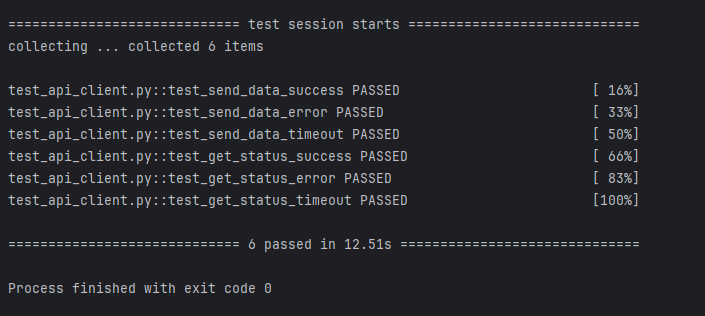

# API Client Testing

Ein kleines, aber vollständiges Testprojekt mit einem API-Client, der `POST`- und `GET`-Anfragen behandelt – samt Fehlerbehandlung, Timeouts und Retry-Logik.

---

## Features

- `send_data(payload)` → POST an eine API
- `get_status()` → prüft API-Verfügbarkeit
- Retry-Mechanismus bei Timeout
- Fehlerausgaben bei Statuscode ≠ 200
- Vollständige Tests mit `pytest` und `unittest.mock`

---



## Testen

```bash
pip install -r requirements.txt
pytest


